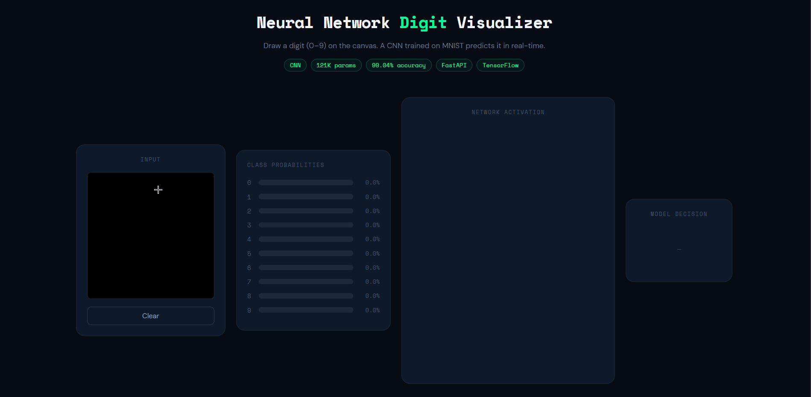
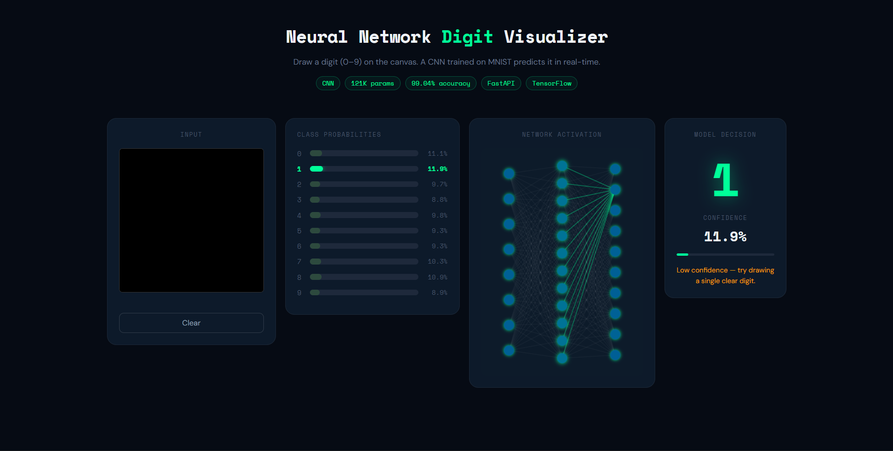
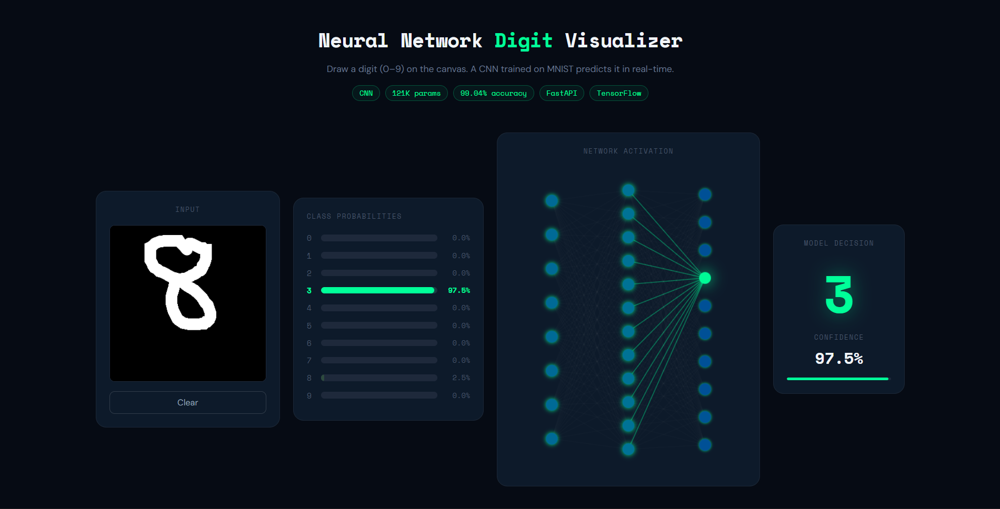

# Neural Network Digit Visualizer


An interactive full-stack web application that lets users draw a digit (0–9) on a canvas and watch a Convolutional Neural Network predict it in real-time. Class probabilities, network activation, and model confidence all update live while drawing.

> 🚀 **Live Demo:** [neural-network-digit-visualizer.vercel.app](https://neural-network-digit-visualizer.vercel.app)

---

## Demo


*Real-time CNN prediction — probability bars and network activation update live while drawing*

---


*Dashboard on page load — 4-panel layout with canvas, probability bars, network visualization, and model decision*

---


*Live prediction — model predicts digit 4 with 97.7% confidence*

---

## Features

- **Real-time inference** — predictions update every ~120ms while drawing, powered by a throttled async pipeline
- **CNN trained on MNIST** — 99.04% test accuracy, 121K parameters
- **Probability visualization** — animated bars for all 10 digit classes (0–9)
- **Neural network glow** — abstract activation visualization with probability-driven glow intensity
- **Confidence indicator** — confidence score with low-confidence warning for ambiguous drawings
- **Responsive layout** — works on desktop and mobile

---

## Architecture

```
User Drawing (Canvas)
       │
       ▼
  React Frontend
  ┌─────────────────────────────────────┐
  │  CanvasBoard (280×280 px)           │
  │  → Downscale to 28×28              │
  │  → Normalize pixel values (0–1)    │
  │  → Throttle requests (120ms)       │
  │  → Async race condition guard      │
  └─────────────┬───────────────────────┘
                │  POST /predict
                │  { image: [784 floats] }
                ▼
  FastAPI Backend
  ┌─────────────────────────────────────┐
  │  model_loader.py (loads once)       │
  │  inference_service.py               │
  │  → Reshape to (1, 28, 28, 1)       │
  │  → CNN inference                   │
  │  → Return probabilities + digit    │
  └─────────────┬───────────────────────┘
                │  JSON Response
                ▼
  { probabilities: [...], predicted_digit: 7, confidence: 0.98 }
```

**Key architectural decisions:**
- Model loaded **once at startup** — not per request — for low latency
- **Image preprocessing on frontend** — keeps backend as a pure inference service
- **Throttle over debounce** — fires every 120ms during drawing for true real-time feel
- **Request ID guard** — prevents stale responses from overwriting fresh predictions

---

## Model Details

| Property | Value |
|---|---|
| Architecture | CNN (Functional API) |
| Dataset | MNIST (60,000 training / 10,000 test) |
| Input shape | (28, 28, 1) |
| Parameters | 121,930 |
| Test accuracy | **99.04%** |
| Optimizer | Adam |
| Loss | Sparse Categorical Crossentropy |
| Epochs | 5 |

**CNN Architecture:**
```
Input (28×28×1)
→ Conv2D(32, 3×3, relu)
→ MaxPooling2D(2×2)
→ Conv2D(64, 3×3, relu)
→ MaxPooling2D(2×2)
→ Flatten
→ Dense(64, relu)
→ Dense(10, softmax)
```

**Why CNN over Dense?**
The initial MVP used a Dense network (~97% accuracy) which struggled with free-hand drawings due to lack of spatial awareness. Upgrading to CNN improved test accuracy to 99.04% and significantly reduced misclassification on real-world drawn digits by learning edge detectors, loops, and stroke structure.

---

## Tech Stack

| Layer | Technology |
|---|---|
| Frontend | React 18, Vite, CSS Grid |
| Backend | FastAPI, Python 3.10 |
| ML Framework | TensorFlow / Keras |
| Model Format | `.keras` |
| API | REST (JSON) |

---

## Project Structure

```
neural-network-digit-visualizer/
│
├── backend/
│   ├── app/
│   │   ├── main.py                  # FastAPI app, CORS, startup
│   │   ├── model/
│   │   │   ├── model_loader.py      # Loads model once at startup
│   │   │   └── mnist_model.keras    # Trained CNN weights
│   │   ├── schemas/
│   │   │   └── prediction_schema.py # Pydantic request/response models
│   │   └── services/
│   │       └── inference_service.py # Preprocessing + prediction logic
│   │
│   ├── train/
│   │   └── train_model.py           # CNN training script
│   │
│   └── requirements.txt
│
├── frontend/
│   ├── src/
│   │   ├── components/
│   │   │   ├── CanvasBoard.jsx      # Drawing canvas with coordinate scaling
│   │   │   ├── ProbabilityBars.jsx  # Animated probability display
│   │   │   └── NeuralNetworkViz.jsx # Canvas-based network glow animation
│   │   ├── services/
│   │   │   └── api.js               # Prediction API call
│   │   ├── App.jsx
│   │   └── App.css
│   │
│   └── package.json
│
└── README.md
```

---

## Running Locally

### Prerequisites

- Python 3.10 or 3.11
- Node.js 20+
- Git

### Backend Setup

```bash
# Clone the repository
git clone https://github.com/Aditya-Ingale/neural-network-digit-visualizer.git
cd neural-network-digit-visualizer/backend

# Create and activate virtual environment
python -m venv venv

# Linux/macOS
source venv/bin/activate

# Windows
venv\Scripts\activate

# Install dependencies
pip install -r requirements.txt

# Start the backend server
python -m uvicorn app.main:app --reload
```

Backend runs at: `http://127.0.0.1:8000`
API docs available at: `http://127.0.0.1:8000/docs`

### Frontend Setup

```bash
# In a new terminal, from project root
cd frontend

# Install dependencies
npm install

# Start the dev server
npm run dev
```

Frontend runs at: `http://localhost:5173`

### Retrain the Model (Optional)

```bash
cd backend
python train/train_model.py
```

Training takes ~1 minute on CPU. Model saves automatically to `backend/app/model/mnist_model.keras`.

---

## API Reference

### `POST /predict`

Accepts a flattened 28×28 grayscale image as a JSON array of 784 normalized floats.

**Request:**
```json
{
  "image": [0.0, 0.12, 0.95, ...]
}
```

**Response:**
```json
{
  "probabilities": [0.001, 0.002, 0.003, 0.98, ...],
  "predicted_digit": 3,
  "confidence": 0.98
}
```

---

## Future Improvements

- [ ] **Upgrade to CNN with rejection class** — train with non-digit samples to handle out-of-distribution input properly
- [ ] **GradCAM visualization** — highlight which pixels influenced the prediction
- [ ] **WebSocket streaming** — replace HTTP polling with persistent connection for lower latency
- [ ] **Model comparison mode** — toggle between Dense and CNN to visualize accuracy difference live
- [ ] **Touch support** — extend canvas drawing to touchscreen events for better mobile UX
- [ ] **Dockerize backend** — containerize FastAPI for consistent deployment

---

## What I Learned

Building this project reinforced several engineering concepts beyond just ML:

- **Distribution shift** — why a model with 99% test accuracy can still struggle on free-hand input, and how preprocessing choices affect real-world performance
- **Async race conditions** — handling out-of-order API responses in a real-time UI using request ID guards
- **Separation of concerns** — keeping image preprocessing on the frontend and inference pure on the backend makes both sides independently testable and scalable
- **Canvas coordinate scaling** — CSS display size vs internal buffer resolution and why coordinate math must account for both

---

## Author

**Aditya-Ingale** — [GitHub](https://github.com/Aditya-Ingale)

---

_Built as a portfolio project to demonstrate full-stack ML engineering._